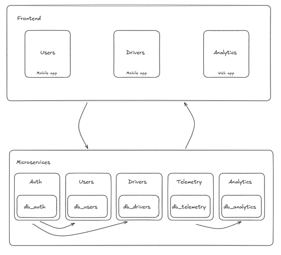

## QuillaBus

### Problema
- Largos tiempos de espera para los pasajeros del transporte público, lo que genera inseguridad, frustración e incertidumbre.

- Conductores y administradores no cuentan con herramientas para monitorear la flota en tiempo real, provocando ineficiencia operativa y desorganización en las rutas.

### Solución
QuillaBus es una aplicación de transporte público inteligente que ofrece rastreo en tiempo real de los buses, permitiendo a los usuarios conocer la ubicación exacta del vehículo, su ruta y el tiempo estimado de llegada.

Los conductores pueden registrar sus vehículos y activar el seguimiento de sus recorridos, facilitando la supervisión y gestión de la flota.

De esta manera, se reduce la incertidumbre de los pasajeros, se mejora la eficiencia del sistema y se fortalece la confianza en el transporte público.


### Fronted
- [Drivers app](https://github.com/santiagohoyos20/drivers)
- [Users app](https://github.com/santiagohoyos20/users)

### Microservicios
- [Microservicio de Autenticación y Seguridad](https://github.com/santiagohoyos20/Microservicio-de-autenticacion-y-seguridad)
- [Microservicio de Gestión de Usuarios y Pasajeros](https://github.com/santiagohoyos20/Microservicio-de-gestion-de-usuarios-y-pasajeros.)
- [Microservicio de Conductores](https://github.com/santiagohoyos20/Microservicio-de-conductores)
- [Microservicio de Flota](https://github.com/santiagohoyos20/Microservicio-de-flota)
- [Microservicio de Telemetría](https://github.com/santiagohoyos20/Microservicio-de-telemetria)
- [Microservicio de Pagos y Recargas](https://github.com/santiagohoyos20/Microservicio-de-pagos-y-recargas)
- [Microservicio de Reportes y Analítica](https://github.com/santiagohoyos20/Microservicio-de-reportes-y-analitica)

### Tecnologías utilizadas
- **Frontend:** React y React Native
- **Backend:** NestJS
- **Bases de datos:** PostgreSQL y MongoDB

### Arquitectura del sistema



## ¿Cómo correrlo?

###  1️⃣ Ejecución con Docker Compose

Esta es la forma más sencilla de levantar todo el entorno localmente.

###  Requisitos previos
- Tener instalado **Docker Desktop**
- Asegurarte de que ningún servicio use los puertos definidos (por ejemplo, `5432`, `3000`, etc.)

### ▶️ Pasos

1. Clonar este repositorio:
   ```bash
   git clone https://github.com/santiagohoyos20/transporte-publico-inteligente.git
   cd transporte-publico-inteligente

2. Crear los archivos .env requeridos por los microservicios (si no existen):
```bash
cp .env.example .env

Levantar los servicios con:

docker compose up --build


Verificar que todos los contenedores estén corriendo:

docker ps
```
3. Acceder a los endpoints expuestos (por ejemplo):

    Auth: http://localhost:3000

    Users: http://localhost:3001

    Drivers: http://localhost:3003

    Telemetry: http://localhost:3002

    Para detener los servicios:
    ```bash
    docker compose down
    ```
